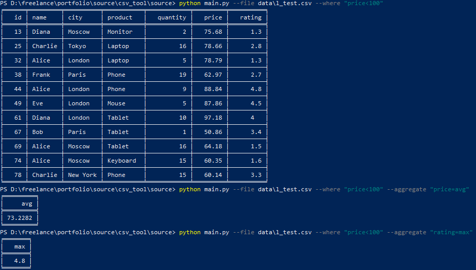
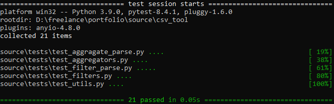

# csv_tool

## Описание  
Утилита для обработки CSV-файлов с фильтрацией и агрегацией.

---

## Структура проекта

- `main.py` - точка входа, обработка аргументов, координация работы
- `argparser.py` - парсинг аргументов командной строки
- `reader.py` - чтение CSV
- `utils.py` - дополнительные функции, ненашедшие себе места в других файлах
- `filter/` - фильтры: базовый класс, конкретные операторы, парсер аргументов
- `aggregators/` - агрегаторы: базовый класс, конкретные реализации, парсер аргументов
- `tests/` - тесты на `pytest`

---

## Тестирование

Тесты написаны с использованием `pytest`, проверяют корректность фильтрации, агрегации, парсинга аргументов, преобразования типов. В тестах рассматриваются как типичные (нормальные) случаи, так и расчитанные на вылет программы.

---

## Соответствие требованиям

- Полное соответствие обязательным требованиям к функционалу
- Использованы только стандартные библиотеки, кроме `tabulate`, `pytest` и `argparse`
- Обьектно-ориентированная структура проекта позволяет добавлять новые дочерние классы, т.е. легко расширять функциональность

---

## Приложение

### Пример исполнения кода:

### Тестирование кода:

